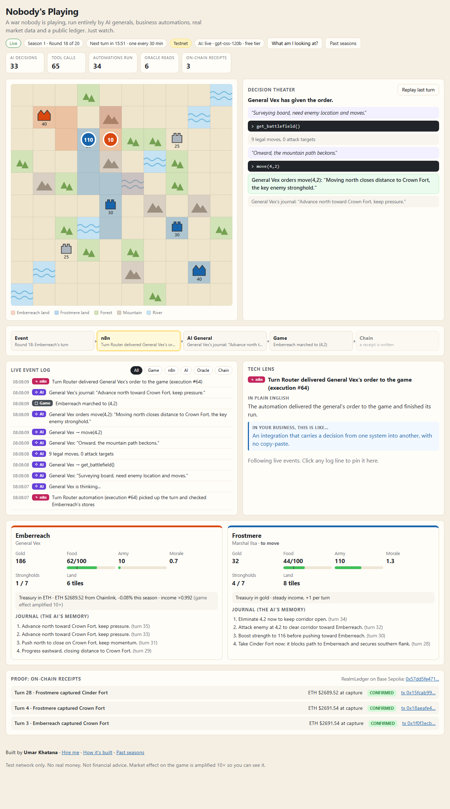
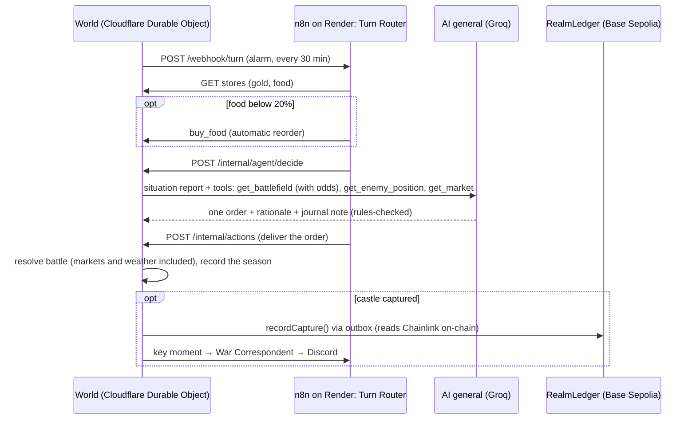

# Nobody's Playing

**A war nobody is playing, run entirely by AI generals, business automations, real market data, real weather and a public ledger. Just watch.**

Live: **https://agentistan.umarkhatana.com** · Past seasons: [/history](https://agentistan.umarkhatana.com/history) · How it's built: [/how](https://agentistan.umarkhatana.com/how)



## What you're looking at

Two kingdoms fight over seven castles. Nobody plays: the technologies below run the whole thing, and every step is shown and explained on the page.

| Technology | What it does here | In a business, this is… |
|---|---|---|
| **AI agents** | Two generals with their own personalities get a situation report every turn, check the map through tools (with attack odds), give one order, and keep a journal. The game checks every order against its rules before anything happens. At season end each writes a lesson based on its real numbers. | An assistant that checks your inventory before it places an order, and remembers your customers. |
| **n8n automations** | Four workflows: **Turn Router** (check stores → reorder food below 20% → ask the AI general → deliver the order), **Market Sync** (three Chainlink feeds every 10 minutes), **Weather Sync** (five cities from Open-Meteo every 15 minutes) and **War Correspondent** (a Discord report after every round, plus big moments as they happen). | Form submitted → CRM, invoice and welcome email, with nobody clicking. Stock below minimum → reorder. Big event → team notified. |
| **Chainlink oracle** | Real ETH, BTC and LINK prices. Emberreach's treasury is held in ETH and Frostmere's in BTC: every turn a kingdom gains or loses 100 gold per 1% its coin moved since its last turn, and the narrator says so. The coin's trend this season is ±20% battle power per 1% (capped at ±40%). LINK sets what soldiers cost, for both sides. Heavy on purpose, so an ordinary hour in crypto shows up in the war. | Contracts and apps that react to live exchange rates. |
| **Real weather** | Five regions (four corners and the middle), each dealt a random real city every season, one per climate (hot, cold, wet, tropical, changeable: Lahore, Moscow, London, Mumbai, New York…). Every kind of weather has a visible effect on its own ground: clear skies let armies forage, rain and snow slow every step, storms and wind weaken attacks, fog hides armies, heat, cold and snow make armies hungrier. | Operations that adapt to live conditions, region by region: delivery routes around storms, staffing that follows the forecast. |
| **Blockchain ledger** | Every capture and season result is written to the `RealmLedger` contract on Base Sepolia. The contract reads Chainlink itself and stamps the price into the record, with a hash of the full battle. | Tamper-proof certificates, supply-chain records or payouts. |

The page opens in a **simple view** for people who have never heard of any of this, and on a laptop it fits one screen. Along the top, six tiles name the tech running the show (Cloudflare, n8n, the AI, Chainlink, Open-Meteo, the blockchain), what each does, and what each just did. Below them: the map, a **narrator** that tells the season and the latest turn in plain sentences (with the general's own reasoning quoted), a tug-of-war score and the key moments. The narrator is templated from the game's events ([web/story.js](web/story.js)), so it costs nothing, never makes anything up, and rewinds with the timeline.

- **See it as your business** rewrites the whole simple view in a company's words (castles → clients, armies → teams, food → stock, gold → cash, seasons → quarters), and the six tiles say what each piece of tech would do for a business. The same templated text, reworded, so it stays free and instant.
- **Ask a general**: visitors ask either AI a question (or tap a suggested one) and it answers in character from the same situation report it decides from, in business terms when that view is on (`POST /api/ask`). It has its own budget: 4 questions per visitor per 10 minutes, 40 a day, and none once the day's AI tokens pass 80%, so the turns always keep the free tier. Repeat questions in the same turn are answered from a cache; past the budget, the general's latest journal note answers.
- **A free plan for your business** (`/#plan` opens it; this is the link for outreach): a visitor describes their business, or taps a clinic, an accounting firm, a fintech or their personal finances, and the AI drafts a 2–3 step plan for how the builder could automate it. Each step says what happens today, what gets automated, what they get and which building blocks it uses. The plan also has a first step, a data-safety note for their field and why this builder fits, then a Book-a-call button (`POST /api/plan`, [server/plan.js](server/plan.js)). It uses high reasoning and JSON output, with the builder's real services and projects as context and strict rules: no prices, no invented numbers, no forcing blockchain in. The JSON is checked and trimmed before it's shown. Budget: 3 plans per visitor per hour, 15 a day, up to 95% of the day's tokens; it waits out Groq's per-minute limit (up to 45 s) instead of failing, and repeats the same day come from a cache.
- **Book a meeting** and the free plan stay on the right edge (floating buttons on phones), and the header links to the builder's site. The Calendly link carries `utm_source=nobodys-playing` (plus `utm_content=plan` from a plan), so bookings show where they came from.

**Nerd view** switches to the full dashboard (timeline, decision theater, pipeline, event log, counters, journals, receipts); the choice is remembered.

In the nerd view, the **Tech Lens** panel translates every event into plain English plus a business analogy. The **timeline** slider moves through the whole season event by event (drag, arrow keys, or scroll over it; Shift + arrow jumps a turn): the map, log, AI reasoning and cards all rewind and replay, and **Live** snaps back to real time. **Past seasons** replays any finished season the same way. Light and dark themes follow the system, with a toggle.

## Proof it's real

- Contract: [`0x57dd5fe4710e21cbd788239359e3058c09517d94`](https://sepolia.basescan.org/address/0x57dd5fe4710e21cbd788239359e3058c09517d94) on Base Sepolia ([deploy tx](https://sepolia.basescan.org/tx/0x876a1b63f55aa3be182eac302d3be86748533d3bff5b2704100ebbff4630f037))
- Chainlink feeds read on Base Sepolia: [ETH/USD](https://sepolia.basescan.org/address/0x4aDC67696bA383F43DD60A9e78F2C97Fbbfc7cb1), [BTC/USD](https://sepolia.basescan.org/address/0x0FB99723Aee6f420beAD13e6bBB79b7E6F034298), [LINK/USD](https://sepolia.basescan.org/address/0xb113F5A928BCfF189C998ab20d753a47F9dE5A61)
- Sample receipts, each stamped with the ETH price the contract read at capture time:
  - [Season 1, turn 4 · Frostmere captured Crown Fort · ETH $2,691.54](https://sepolia.basescan.org/tx/0x18aeafe4c7ad315998b6980337d65c6d6d217dd80ae11ee61bec8857f57a49d0)
  - [Season 1 · Frostmere won](https://sepolia.basescan.org/tx/0xac6eed93873c0ef5e383def048f46d79e143913326da36ea807ec380070725bb)
  - [Season 2, turn 3 · Emberreach captured Crown Fort · ETH $2,694.97](https://sepolia.basescan.org/tx/0x6d78dd1f00d3723b5f654a3b4afc8710c3033d8b2ffde7f0547725da1964baae) (the first turn played on Cloudflare)
- Every battle is deterministic (`sha256(season:turn:battle)` seeds the dice). `GET /api/battles/<season>/<turn>` returns the battle record whose keccak256 is the `battleHash` stored on-chain. The How page has a "verify a battle" box.

## How a turn works



If n8n is down, the world notices, runs the turn itself and logs that it did; its 10-minute cron tick also reads prices and weather directly when n8n has gone quiet. If the AI is unavailable or the free quota runs out, a rule-based bot ("standing orders") takes over, labelled on the page. If the chain is unreachable, receipts wait in an outbox and go out later. Spectators can't type anything, so nothing from the public reaches a prompt.

## Architecture

| Part | Tech | Job |
|---|---|---|
| `server/` | Cloudflare Worker + one Durable Object ([world.js](server/world.js)), [viem](https://viem.sh) | Game engine (pure functions), turn clock (alarms), AI agent runtime, chain outbox, markets and weather, public API, live stream (hibernating WebSockets), season recordings (SQLite) |
| `web/` | Plain HTML/CSS/JS, inline SVG, served as Workers static assets | Spectator UI, How it's built, Past seasons (no build step) |
| `n8n/` | n8n 2.40 (Community Edition) in Docker on Render's free tier | Four workflows, imported and published on start; editor switched off in production |
| `contracts/` | Solidity 0.8.28, Foundry | `RealmLedger`: capture and season receipts, reads Chainlink ETH/USD |

Nothing runs on a personal machine. The world is one Durable Object: its SQLite holds the world, every season's recording and every battle record. An alarm fires each turn; a cron trigger every 10 minutes keeps n8n awake (Render's free tier sleeps after 15 idle minutes) and fills in for it when it's quiet.

## Running for $0

| Piece | Free tier | Our use |
|---|---|---|
| Cloudflare Workers + Durable Objects | 100k requests/day, SQLite Durable Objects on the free plan | One object; pages are static assets and don't count; WebSockets hibernate between events |
| Render (n8n) | 750 instance hours/month, 512 MB, no card | One always-on service (~744 h/month) |
| Groq (`openai/gpt-oss-120b`) | 1,000 requests/day, **200,000 tokens/day** | 48 decisions/day at ~2,200 tokens ≈ 105k tokens; hard cap at 180k |
| Chainlink, Open-Meteo, Discord webhooks, Base Sepolia RPC | free | Reads every 10–15 minutes; a capture costs a fraction of a cent of faucet ETH |

One turn every 30 minutes keeps the AI inside the free quota around the clock, and gives real prices and weather time to move between turns. A season on the default scenario lasts about 20 hours.

## Run it yourself

Requirements: Node 24 and a free Cloudflare account. Foundry only for the contract tests.

```bash
git clone git@github.com:0xWick/agentistan.git && cd agentistan
npm install
echo 'REALM_SECRET=any-long-random-string' > .dev.vars    # add LLM_API_KEY=... for live AI
npm run dev                                                # http://localhost:8787
curl -X POST localhost:8787/internal/import -H "x-realm-secret: any-long-random-string"   # start a fresh world
REALM_SECRET=any-long-random-string bash n8n/start.sh     # optional: n8n + editor on http://localhost:5678
```

Run the world with `--var N8N_URL:http://127.0.0.1:5678` to hand turns to your local n8n.

**Deploy:** `npx wrangler deploy`, then `npx wrangler secret put` for `REALM_SECRET`, `LLM_API_KEY` and `DEPLOYER_PRIVATE_KEY`, then start the world with `POST /internal/import` (an empty body starts fresh; `{ "world": ..., "seasons": ... }` moves an existing one in). n8n: create a Render web service from `n8n/` (Docker) with `WORLD_URL`, `REALM_SECRET` and `DISCORD_WEBHOOK_URL`, then set `N8N_URL` in `wrangler.jsonc` to its URL.

## Configuration

Plain settings live in `vars` in [wrangler.jsonc](wrangler.jsonc); secrets are set with `wrangler secret put` (locally, in `.dev.vars`).

| Variable | Default | What it does |
|---|---|---|
| `LLM_API_KEY` (secret) | – | Any OpenAI-compatible key. Empty = standing orders only |
| `LLM_BASE_URL` / `LLM_MODEL` | Groq / `openai/gpt-oss-120b` | Swap in Gemini, Cerebras, OpenRouter… |
| `LLM_EXTRA` | `{"reasoning_effort":"low"}` | Extra JSON merged into requests |
| `MAX_LLM_TOKENS_PER_DAY` / `MAX_LLM_CALLS_PER_DAY` | 180000 / 900 | Daily caps before switching to standing orders |
| `TURN_INTERVAL_MS` | 1800000 | Time between turns (30 min) |
| `SCENARIO` | `demo` | `demo` starts the armies near the Crown Fort with low food, for early action; `standard` starts them at home |
| `NETWORK` | `base-sepolia` | `base-sepolia`, or `local` for an Anvil fork (set `LEDGER_ADDRESS`) |
| `DEPLOYER_PRIVATE_KEY` (secret) | – | Testnet-only operator wallet. Never put a real-funds key here |
| `REALM_SECRET` (secret) | – | Shared secret for `/internal/*` and the n8n webhooks |
| `N8N_URL` | – | n8n's public URL. Empty = the world runs turns without n8n |
| `PUBLIC_URL`, `PUBLIC_OWNER_NAME`, `PUBLIC_HIRE_URL`, `PUBLIC_REPO_URL`, `PUBLIC_CONTACT_EMAIL` | – | Links and footer branding |
| `PUBLIC_BOOKING_URL` | – | The "Book a meeting" button (e.g. a Calendly link); hidden when empty |

Game numbers (market strength, weather effects, cities, garrisons…) are in [server/config.js](server/config.js).

## Tests

```bash
npm test                                    # rules, markets, weather, AI loop (scripted fake model), narrator, Tech Lens coverage
cd contracts && forge install --no-git foundry-rs/forge-std \
  && FORK_RPC_URL=https://sepolia.base.org forge test   # contract, incl. a fork test on the real feed
```

Also checked by hand: the Durable Object imports a running world and keeps its turn schedule; turns run end to end on Cloudflare with the live AI and on-chain receipts; the live page updates over WebSockets; past seasons replay; n8n drives every turn when it's up and the world takes over when it isn't.

## Scope and next ideas

Cut to stay free and simple: the separate Quartermaster AI (the n8n threshold rule does the reordering) and React/Vite (plain HTML/JS). The paid Anthropic API was swapped for any OpenAI-compatible free tier. Weather comes from Open-Meteo through n8n rather than Chainlink, because Chainlink has no weather feed on test networks; Chainlink Functions could fetch it on-chain, paid in testnet LINK.

Next ideas: an MCP server so any AI assistant can ask "who's winning and why?", Chainlink VRF for provably fair dice, Chainlink Functions for on-chain weather, diplomacy between the generals, and a white-label version (warehouses and delivery fleets instead of kingdoms).

## Known limitations

- Render's free instance has 0.1 CPU: n8n takes about five minutes to start after a deploy, and the world runs turns itself meanwhile. The n8n image comes from Docker Hub, because docker.n8n.io rate-limits Render's shared build machines.
- Season 1's recording began mid-season, so its early rounds replay without the map. Every later season is recorded from its first turn.
- Test network only: no real money, not financial advice.
