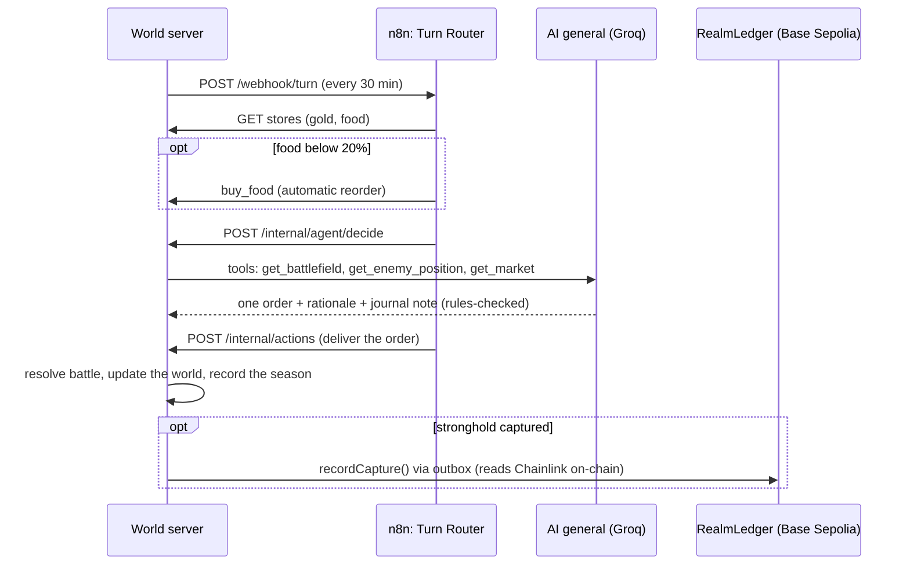

# Nobody's Playing

**A war nobody is playing, run entirely by AI generals, business automations, real market data and a public ledger. Just watch.**

Live: **https://nobodysplaying.umarkhatana.com** · Past seasons: [/history](https://nobodysplaying.umarkhatana.com/history) · How it's built: [/how](https://nobodysplaying.umarkhatana.com/how)


## What you're looking at

Two kingdoms fight over seven strongholds. Nobody plays: four technologies run the whole thing, and every step is shown and explained on the page.

| Technology | What it does here | In a business, this is… |
|---|---|---|
| **AI agents** | Two generals with their own personalities read the battlefield through tools, give one order per turn, and keep a journal (memory). The game checks every order against its rules before anything happens. | An assistant that checks your inventory before it places an order, and remembers your customers. |
| **n8n automations** | Every turn runs as an n8n workflow: check the kingdom's stores → reorder food if it's below 20% → ask the AI general → deliver the order. A second workflow syncs the ETH price every 10 minutes. | Form submitted → CRM, invoice and welcome email, with nobody clicking. Stock below minimum → reorder. |
| **Chainlink oracle** | The real ETH/USD price comes in from Chainlink. Emberreach keeps its treasury in ETH, so the market moves its income (amplified 10× so you can see it). | Contracts and apps that react to live exchange rates, weather or shipping data. |
| **Blockchain ledger** | Every capture is written to the `RealmLedger` contract on Base Sepolia. The contract reads Chainlink itself and stamps the price into the record, with a hash of the full battle. | Tamper-proof certificates, supply-chain records or payouts. |

The **Tech Lens** panel translates every event into plain English plus a business analogy. **Past seasons** replays any finished season as a timelapse.

## Proof it's real

- Contract: [`0x57dd5fe4710e21cbd788239359e3058c09517d94`](https://sepolia.basescan.org/address/0x57dd5fe4710e21cbd788239359e3058c09517d94) on Base Sepolia ([deploy tx](https://sepolia.basescan.org/tx/0x876a1b63f55aa3be182eac302d3be86748533d3bff5b2704100ebbff4630f037))
- Chainlink ETH/USD feed it reads: [`0x4aDC67696bA383F43DD60A9e78F2C97Fbbfc7cb1`](https://sepolia.basescan.org/address/0x4aDC67696bA383F43DD60A9e78F2C97Fbbfc7cb1)
- Sample receipts, each stamped with the ETH price the contract read at capture time:
  - [Turn 3 · Emberreach captured Crown Fort · ETH $2,691.54](https://sepolia.basescan.org/tx/0x1f0f3ecb4210086fe90038cf32965a441031c73fc35feabc9f36bf18d7c58cd2)
  - [Turn 4 · Frostmere captured Crown Fort · ETH $2,691.54](https://sepolia.basescan.org/tx/0x18aeafe4c7ad315998b6980337d65c6d6d217dd80ae11ee61bec8857f57a49d0)
  - [Turn 28 · Frostmere captured Cinder Fort · ETH $2,689.52](https://sepolia.basescan.org/tx/0x15fcab990327c12df0744aa90c967ae754308f53d505a7a2a7077d533dcc06f6)
- Every battle is deterministic (`sha256(season:turn:battle)` seeds the dice). `GET /api/battles/<season>/<turn>` returns the battle record whose keccak256 is the `battleHash` stored on-chain. The How page has a "verify a battle" box.

## How a turn works



If n8n is down, the world notices, runs the turn itself and logs that it did. If the AI is unavailable or the free quota runs out, a rule-based bot ("standing orders") takes over, labelled on the page. If the chain is unreachable, receipts wait in an outbox and go out later. Spectators can't type anything, so nothing from the public reaches a prompt.

## Architecture

| Part | Tech | Job |
|---|---|---|
| `server/` | Node 22+, `node:http`, SSE, [viem](https://viem.sh) | Game engine (pure functions), turn clock, AI agent runtime, chain outbox, public API, live stream, season recordings |
| `web/` | Plain HTML/CSS/JS, inline SVG | Spectator UI, How it's built, Past seasons (no build step) |
| `n8n/` | n8n 2.40 (self-hosted, Community Edition) | Turn Router and Market Sync workflows, imported and published on start |
| `contracts/` | Solidity 0.8.28, Foundry | `RealmLedger`: capture and season receipts, reads Chainlink ETH/USD |
| `scripts/` | bash | `dev.sh` runs everything; `tunnel.sh` publishes on a Cloudflare domain; `autodeploy.sh` deploys on push |

State is one JSON snapshot (`data/world.json`, written atomically, restart-safe). Each season is also recorded append-only to `data/seasons/season-N.jsonl`, which feeds the timelapses.

## Running for $0: the free-tier math

The AI runs on Groq's free tier (`openai/gpt-oss-120b`: 1,000 requests/day, 8,000 tokens/minute, **200,000 tokens/day**). A decision takes about 2 model calls and ~2,700 tokens (up to ~4,000 when the model corrects an illegal order).

| Turn every | AI decisions/day | Tokens/day (typical) | Worst case | Verdict |
|---|---|---|---|---|
| 15 min | 96 | 259k | 384k | over the free limit |
| 20 min | 72 | 194k | 288k | too tight |
| **30 min** | **48** | **~130k (65%)** | **~192k** | **default** |
| 60 min | 24 | ~65k | ~96k | fine but slow |

A hard cap (`MAX_LLM_TOKENS_PER_DAY=180000`) switches to standing orders before the free limit. Thirty minutes also gives the real ETH price time to move between turns: a typical 0.2–0.5% move becomes a 2–5% swing in Emberreach's income. A season on the default scenario lasts about 20 hours.

Everything else is free as well: n8n Community Edition (self-hosted), Base Sepolia test ETH from a faucet (a capture costs a tiny fraction of a cent), the public `sepolia.base.org` RPC, and Cloudflare Tunnel.

## Run it yourself

Requirements: Linux or WSL, Node 24 (for n8n; the world server runs on 22+), and [Foundry](https://getfoundry.sh) only for the local chain and contract tests.

```bash
git clone git@github.com:0xWick/agentistan.git && cd agentistan
npm install
cp .env.example .env        # add a free Groq key (console.groq.com) and a fresh testnet key
bash scripts/dev.sh start   # n8n + world (+ Anvil fork when NETWORK=local)
# open http://localhost:8080 ; the n8n editor is at http://localhost:5678 (create the owner account on first visit)
```

- **Local chain first:** `NETWORK=local` runs an Anvil fork of Base Sepolia (real Chainlink data, no faucet needed) and deploys the contract automatically.
- **Public testnet:** fund the wallet from a Base Sepolia faucet, then `NETWORK=base-sepolia npm run deploy` and set `NETWORK=base-sepolia` in `.env`.
- **Your own domain (free):** `bash scripts/tunnel.sh [subdomain]` logs in to Cloudflare, creates a named tunnel and the DNS record, and publishes only the world server. The n8n editor stays on localhost.
- **Deploy on push:** when the repo has an `origin`, `dev.sh` also runs `scripts/autodeploy.sh`. Every minute it fast-forwards to `origin/main` and restarts only what changed (page changes need no restart).
- Other commands: `bash scripts/dev.sh status | stop [name] | restart [name]`. Logs are in `data/*.log`.

## Configuration

| Variable | Default | What it does |
|---|---|---|
| `LLM_API_KEY` | – | Any OpenAI-compatible key. Empty = standing orders only |
| `LLM_BASE_URL` / `LLM_MODEL` | Groq / `openai/gpt-oss-120b` | Swap in Gemini, Cerebras, OpenRouter, Ollama… |
| `LLM_EXTRA` | – | Extra JSON merged into requests, e.g. `{"reasoning_effort":"low"}` |
| `MAX_LLM_TOKENS_PER_DAY` / `MAX_LLM_CALLS_PER_DAY` | 180000 / 900 | Daily caps before switching to standing orders |
| `TURN_INTERVAL_MS` | 1800000 | Time between turns (30 min) |
| `SCENARIO` | `standard` | `demo` starts the armies near the Crown Fort with low food, for early action |
| `NETWORK` | `local` | `local` (Anvil fork) or `base-sepolia` |
| `DEPLOYER_PRIVATE_KEY` | – | Testnet-only operator wallet. Never put a real-funds key here |
| `CHAIN_RPC_URL` / `ORACLE_RPC_URL` | `https://sepolia.base.org` | Chain and oracle RPC endpoints |
| `REALM_SECRET` | – | Shared secret for `/internal/*` (world ↔ n8n) |
| `N8N_TURN_WEBHOOK` | `http://127.0.0.1:5678/webhook/turn` | Empty = the world runs turns without n8n |
| `IDLE_MODE` | – | `pause` pauses the clock after 5 minutes with no viewers |
| `TUNNEL_NAME` / `QUICK_TUNNEL` | – | Named Cloudflare tunnel (set by `tunnel.sh`), or `1` for a temporary trycloudflare.com URL |
| `PUBLIC_OWNER_NAME`, `PUBLIC_HIRE_URL`, `PUBLIC_REPO_URL`, `PUBLIC_CONTACT_EMAIL` | – | Footer branding |
| `HOST` / `PORT` | `127.0.0.1` / 8080 | Where the world server listens |

## Tests

```bash
npm test                                    # rules, AI loop (scripted fake model), Tech Lens coverage
cd contracts && forge install --no-git foundry-rs/forge-std \
  && FORK_RPC_URL=https://sepolia.base.org forge test   # contract, incl. a fork test on the real feed
```

Also checked by hand on the local fork and then on Base Sepolia: n8n drives every turn (its own execution records all succeed); the food alert reorders; the world falls back when n8n is killed and hands back when it returns; restarts resume the same turn without duplicate receipts; on-chain `ownerOf` matches the world; battle hashes match; and a season end writes `recordSeasonResult`, stores lessons and starts the next season.

## V1 scope

This first version keeps what makes each technology visible and provable, and cuts the rest to stay free and simple. Cut for now, from the original spec: the Discord "Town Crier" workflow, the separate Quartermaster AI (the n8n threshold rule does the reordering), SQLite (JSON snapshot and append-only season logs), React/Vite/Tailwind (plain HTML/JS), the Docker/Playwright test tiers, and Caddy/VPS hosting (Cloudflare Tunnel instead). The paid Anthropic API was swapped for any OpenAI-compatible free tier.

Next ideas: an MCP server so any AI assistant can ask "who's winning and why?", Chainlink VRF for provably fair dice, spectator voting on weather events, diplomacy between the generals, and a white-label version (warehouses and delivery fleets instead of kingdoms).

## Known limitations

- It runs on one machine behind a Cloudflare Tunnel. If that machine sleeps or reboots, the site is down until `bash scripts/dev.sh start`. A free always-on VM (for example Oracle Cloud Always Free) runs the same scripts.
- Season 1's recording began mid-season. Every later season is recorded from its first turn.
- n8n runs from npm, which the n8n project now marks as deprecated in favour of its Docker image. It works on 2.40.7.
- Test network only: no real money, not financial advice.
